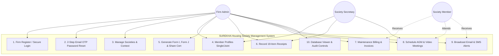
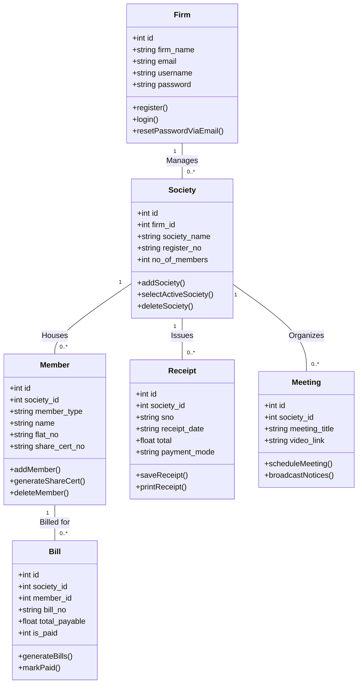
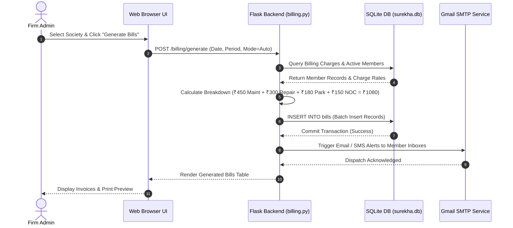
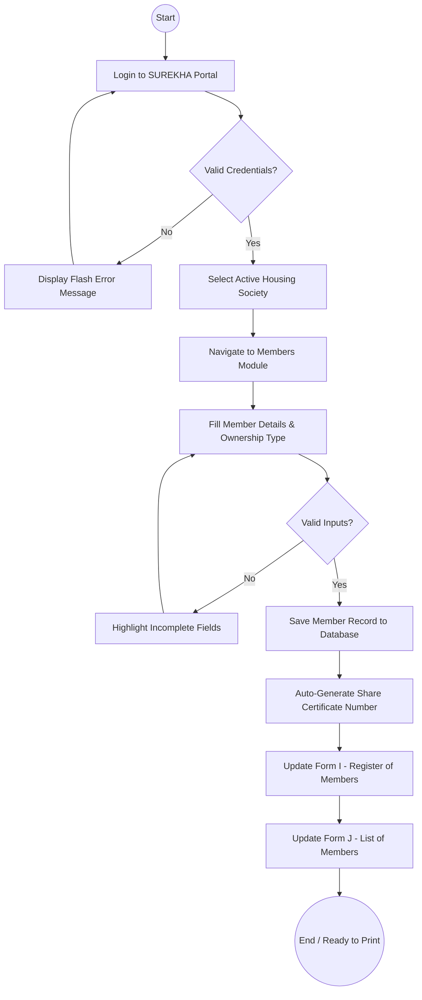
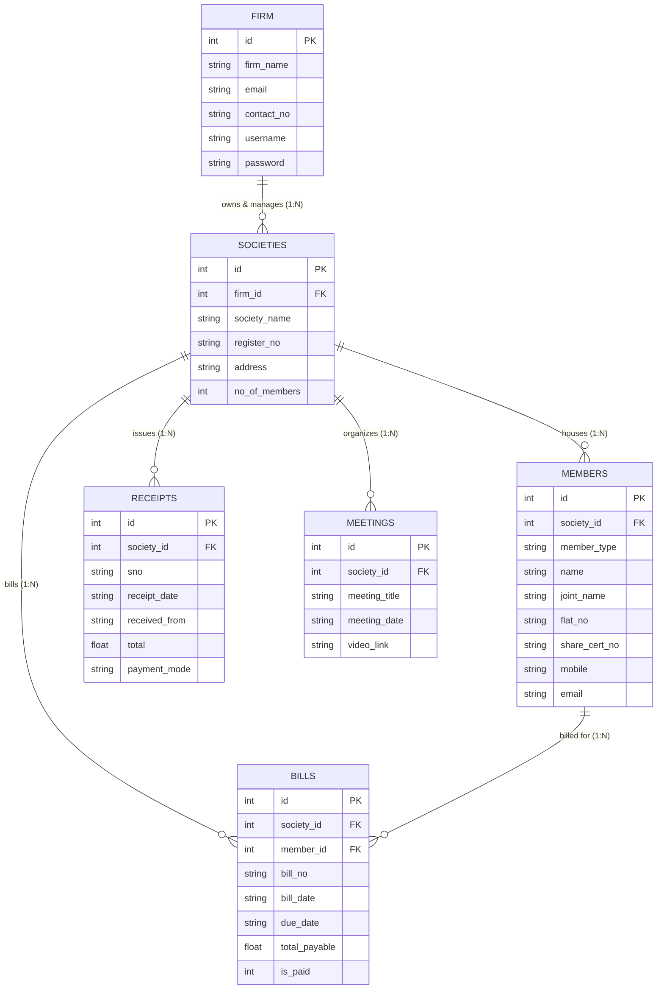
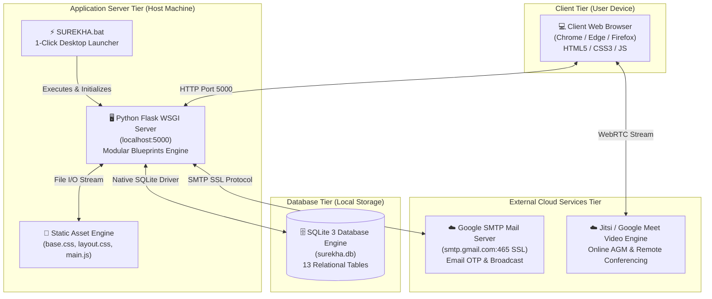

# 📘 TYCS-SEM-V MINI PROJECT REPORT
# Project Title: SUREKHA — Multi-Society Housing Management & Statutory Accounting System

---

# 📌 MODULE 1: Problem Identification, Requirement Engineering & System Design Phase

---

## 1. Problem Identification & Feasibility Study

### 1.1 Identification of a Real-World Problem
Co-operative Housing Societies (CHS) in India (especially under the Maharashtra Co-operative Societies Act) face severe operational hurdles in manually maintaining member registers, calculating monthly maintenance bills, issuing statutory 19-item collection receipts, recording ledger entries, and conducting Annual General Body Meetings (AGM). When Management Firms (Estate Managers) oversee multiple societies, the lack of a centralized, multi-tenant digital platform results in duplicate entries, misplaced statutory forms (Form I, Form J, Share Certificates), delayed bill collections, and communication breakdowns.

### 1.2 Problem Justification
- **Human Errors:** Manual calculations of interest, sinking funds, and parking charges often cause discrepancies.
- **Statutory Non-Compliance:** Physical maintenance of Maharashtra Form I (Register of Members) and Form J (List of Members) is tedious and prone to physical damage.
- **Billing Delays:** Generating and distributing physical bills for hundreds of flats takes several days.
- **Lack of Transparency:** Members cannot easily track itemized dues, leading to disputes over penalties.

### 1.3 Scope Definition
**SUREKHA** is an automated web platform designed for Housing Society Management Firms to:
- Manage multiple cooperative housing societies under a single firm account.
- Automate member record-keeping, single/joint ownerships, and share certificate allocations.
- Generate official Maharashtra Form I, Form J, and Share Certificate layouts.
- Record 19-item statutory financial collection receipts, payment vouchers, journals, and ledgers.
- Automate monthly maintenance bill generation (Auto/Manual) with printable invoices.
- Provide 2-Step Email OTP security for password recovery via Gmail SMTP SSL.
- Facilitate remote AGM/EGM video conferencing and digital uppercase notice boards.
- Provide live SQLite database administration and record auditing with password masking.

### 1.4 Stakeholder Identification
1. **Firm Admin (Super User):** Registers housing societies, configures billing rates, and monitors overall collections.
2. **Society Office Bearers (Chairman / Secretary / Treasurer):** Records collection receipts, maintains statutory forms, and schedules meetings.
3. **Society Members (Flat Owners / Residents):** Receives monthly maintenance invoices, circular notices, and joins video meetings.

### 1.5 Feasibility Study

#### 1.5.1 Technical Feasibility
The project utilizes a proven, lightweight open-source stack:
- **Backend:** Python 3 Flask microframework with Blueprint modular architecture.
- **Database:** SQLite 3 (ACID compliant embedded relational database).
- **Frontend:** Standard HTML5, Modular CSS3, and Vanilla JavaScript.
- **Services:** Google Gmail SMTP SSL for instant OTP delivery and WebRTC for video meetings.
The system runs smoothly on standard hardware without heavy external dependencies.

#### 1.5.2 Economic Feasibility
The software relies 100% on open-source, free tools (Python, Flask, SQLite, HTML5/CSS3). There are zero software licensing costs, making it economically viable for housing societies and small-to-medium estate firms.

#### 1.5.3 Operational Feasibility
The user interface features a clean, responsive layout with intuitive navigation menus, auto-calculating forms, 1-click delete actions, and single-click Desktop execution (`SUREKHA.bat`), requiring minimal technical training.

---

## 2. Requirement Engineering

### 2.1 Functional Requirements Specification (FRS)
- **FR-1: Authentication & Firm Setup:** Firm registration, secure login, session management, and 2-Step Email OTP password recovery.
- **FR-2: Multi-Society Management:** Create, list, switch, and delete cooperative housing societies.
- **FR-3: Member & Share Management:** Add member profiles with single/joint ownership, share certificate number, flat/shop details, and nomination.
- **FR-4: Statutory Form Registers:** Generation of official Maharashtra Form I (Register of Members), Form J (List of Members), and Share Certificates.
- **FR-5: 19-Item Financial Receipts:** Record collection across 19 statutory funds (entrance fees, shares, sinking fund, service charges, municipal taxes, parking, etc.) with automatic total computation and printable vouchers.
- **FR-6: Accounting Entries & Ledger:** Payment vouchers, journal entries, account ledgers, and cash/bank counter balances.
- **FR-7: Maintenance Billing Engine:** Configurable charge structure (Maintenance ₹450, Repair ₹300, Parking ₹180, NOC ₹150) with Auto/Manual batch generation and printable bills.
- **FR-8: Final Accounts & Reports:** Generation of Income & Expenditure statement, Balance Sheet, and Members Outstanding Dues summary.
- **FR-9: Digital Meetings & Notices:** Meeting scheduler, digital uppercase notice board, WebRTC video meeting room, and bulk broadcast notifications.
- **FR-10: Database Viewer:** Live inspection and CRUD controls across all 13 SQLite tables with password masking (`••••••••`).

### 2.2 Non-Functional Requirements (NFRS)
- **NFR-1 Security:** Encrypted session cookies, SSL SMTP email OTP verification, and masked password storage across views.
- **NFR-2 Code Modularization:** Strict compliance with ≤ 80 lines per Python/CSS/HTML source file.
- **NFR-3 Performance:** Sub-50ms query response time via local embedded SQLite engine.
- **NFR-4 Reliability & ACID Compliance:** Atomic database commits preventing incomplete accounting transactions.
- **NFR-5 Usability:** Clean Navy Blue (`#1a237e`) and Warm Gold (`#f9a825`) visual theme with responsive grid layouts.

### 2.3 Use-Case Analysis
- **Primary Actor:** Firm Admin / Society Manager
- **Core Activities:** Firm Login $\rightarrow$ Select Society $\rightarrow$ Register Members $\rightarrow$ Generate Bills $\rightarrow$ Record Receipts $\rightarrow$ Issue Form I/J $\rightarrow$ Conduct AGM Video Meetings $\rightarrow$ View Database.

### 2.4 Requirement Prioritization (MoSCoW Matrix)
- **Must Have:** Firm Auth, Society Selection, Member Roster, 19-Item Receipts, Billing Engine, Form I/J.
- **Should Have:** Email OTP Password Reset, Printable Invoices, Cash/Bank Ledger, Meeting Scheduler.
- **Could Have:** WebRTC Video Meetings, Broadcast Notification, Live DB Viewer.
- **Won't Have (Current Scope):** Payment gateway integration (handled via offline Cash/Cheque/Bank Transfer).

### 2.5 Constraints and Assumptions
- Max 80 lines source code modularity constraint.
- Single host server architecture with multi-browser client connectivity.
- Assumes valid internet connection for Gmail SMTP OTP delivery and Jitsi video calling.

---

## 3. Software Development Life Cycle (SDLC) Planning

### 3.1 Selection of SDLC Model
The **Agile Incremental Model** was selected. It allowed dividing the application into modular sprints (Auth $\rightarrow$ Members $\rightarrow$ Entries $\rightarrow$ Billing $\rightarrow$ Registers $\rightarrow$ Testing), ensuring continuous testing and user feedback at each increment.

### 3.2 Work Breakdown Structure (WBS)
```
SUREKHA Platform (WBS)
├── 1.0 Planning & Requirements
│   ├── 1.1 Problem Analysis & Scope
│   └── 1.2 Feasibility & Resource Allocation
├── 2.0 System & Database Design
│   ├── 2.1 13-Table Relational Schema Design (surekha.db)
│   └── 2.2 UML System Modeling (ER, Class, Sequence, Activity, Use Case, Deployment)
├── 3.0 Core Application Development
│   ├── 3.1 Auth & 2-Step Email OTP Module
│   ├── 3.2 Society & Member Management Module
│   ├── 3.3 19-Item Receipts & Accounting Entries
│   ├── 3.4 Maintenance Billing & Invoicing Engine
│   └── 3.5 Statutory Registers (Form I, J, Share Cert) & Video Meetings
├── 4.0 Testing & Quality Assurance
│   ├── 4.1 Unit & Integration Testing
│   └── 4.2 Security & Input Validation Checks
└── 5.0 Deployment & Documentation
    ├── 5.1 1-Click Desktop Launcher Setup (SUREKHA.bat)
    └── 5.2 Final Technical Documentation & Blackbook
```

### 3.3 Project Timeline
- **Phase 1 (Week 1):** Requirement Gathering, SRS Preparation, Database Schema Setup.
- **Phase 2 (Week 2):** Backend Modular Blueprints & Base Split CSS Layout.
- **Phase 3 (Week 3):** Core Financial Accounting, 19-Item Receipts & Maintenance Billing.
- **Phase 4 (Week 4):** Statutory Form I/J Layouts, Video Meetings, Gmail SMTP OTP, Testing & Documentation.

### 3.4 Gantt Chart
| Milestone / Task | Week 1 | Week 2 | Week 3 | Week 4 |
|---|:---:|:---:|:---:|:---:|
| **1. Requirements & Schema** | ██████ | | | |
| **2. Auth & Society Blueprints** | | ██████ | | |
| **3. Financial Accounting & Bills** | | | ██████ | |
| **4. Statutory Registers & Testing** | | | | ██████ |

### 3.5 Resource Planning
- **Hardware:** Standard PC/Laptop (Intel Core i3/i5, 4GB+ RAM, 100MB Disk Space).
- **Software Stack:** Windows 10/11, Python 3.10+, VS Code, Modern Web Browser (Chrome/Edge).
- **Communication Gateway:** Google Gmail SMTP Server (Port 465 SSL).

---

## 4. System Modeling Using UML

### 4.1 Use Case Diagram


### 4.2 Class Diagram


### 4.3 Sequence Diagram (Issue Maintenance Bill & Payment)


### 4.4 Activity Diagram (Member Registration & Form I/J Sync)


### 4.5 Entity-Relationship (ER) Diagram


### 4.6 Deployment Diagram


---

## 5. System Architecture Design

### 5.1 Frontend Architecture
Modular Split CSS architecture ensures lightning-fast loading and separation of concerns:
- `base.css`: CSS reset, color palette variables, typography, flash alerts, and status badges.
- `layout.css`: Sidebar navigation, top navigation bar, active society banner, responsive container.
- `components.css`: Content cards, data tables, buttons (`.btn-primary`, `.btn-danger`, `.btn-accent`), and stat cards.
- `forms.css`: Multi-column form grids, text inputs, dropdowns, and 19-item receipt particulars grid.
- `auth.css`: Centered card layout for Login, Registration, and OTP recovery.
- `print.css`: Dedicated print media stylesheets for invoices, vouchers, and Maharashtra Form I & J formats.

### 5.2 Backend Architecture
Python Flask application structured with Blueprint pattern:
- `auth_bp`: Authentication, Registration, and Gmail SMTP OTP handler.
- `society_bp`: Society creation, selection context, and deletion.
- `members_bp`: Member profile management and broadcast communication.
- `entries_bp`: 19-Item receipts, payments, journal entries, ledgers, and cash/bank counter.
- `billing_bp`: Maintenance charge configuration and batch bill calculation engine.
- `accounts_bp`: Income & Expenditure statements and Balance Sheet generator.
- `reports_bp`: Members outstanding report and roster summaries.
- `registers_bp`: Official Form I, Form J, and Share Certificate renderers.
- `meetings_bp`: AGM scheduler, notice board, and video meeting integration.
- `database_view_bp`: Live SQLite administrative CRUD viewer.

### 5.3 Database Schema Design (13 Core Tables)
`firm`, `societies`, `members`, `ij_share_forms`, `receipts`, `payments`, `journal`, `ledger`, `cash_bank`, `billing_charges`, `bills`, `meetings`, `meeting_points`.

### 5.4 API & Routing Structure
RESTful clean URLs:
- `/login`, `/register`, `/forgot-password`, `/logout`
- `/societies`, `/societies/add`, `/societies/select/<id>`, `/societies/delete/<id>`
- `/members`, `/members/add`, `/members/delete/<id>`, `/members/notify-all`
- `/entries/receipt`, `/entries/receipt/add`, `/entries/receipt/print/<id>`, `/entries/receipt/delete/<id>`
- `/billing`, `/billing/config`, `/billing/generate`, `/billing/print/<id>`, `/billing/paid/<id>`, `/billing/delete/<id>`
- `/database-view`, `/database-view/delete/<table>/<id>`, `/database-view/delete-all/<table>`

### 5.5 Security Considerations
- **SQL Injection Prevention:** Parameterized SQL queries with `?` placeholders across all DB operations.
- **Credential Protection:** Passwords masked as `••••••••` across all UI and Database Viewer interfaces.
- **Session Integrity:** Secret session keys and route protection (`chk()` context checks).
- **Safe Password Reset:** 2-Step OTP delivered directly to verified Gmail via SMTP SSL, never displayed in plain text on screen.

---

# 📌 MODULE 2: Implementation, Testing, Deployment & Evaluation Phase

---

## 7. Application Development

### 7.1 Frontend Implementation
Developed using semantic HTML5, modern CSS3 Flexbox/Grid, and modular JavaScript (`main.js`):
- Real-time automatic sum calculation for 19 receipt items.
- Dynamic meeting agenda point builder.
- Auto-dismissing flash notification banners (3.5s timeout).
- Confirmation modals (`confirm()`) before executing delete actions.

### 7.2 Backend Implementation
Written in Python 3 using Flask:
- 10 distinct Blueprint controllers enforcing strict line limits (≤ 80 lines per file).
- Helper modules for number-to-words currency conversion (`num_words()`).
- Atomic transactions with automatic commit and rollback handling.

### 7.3 Database Integration
Utilizes Python's native `sqlite3` driver with `database.py`:
- `get_db()`: Initializes connection with `sqlite3.Row` row factory for dictionary-like column access.
- `init_db()`: Executes DDL scripts automatically creating all 13 tables on initial startup.

### 7.4 Authentication and Validation
- Mandatory validation on required input fields (`required` attributes and backend null checks).
- Session authorization verifying `session['firm_id']` and active `session['society_id']`.
- 6-Digit pseudo-random OTP generator (`random.randint(100000, 999999)`) with 10-minute session expiry.

### 7.5 Error Handling
- Comprehensive `try...except` blocks across database transactions, SMTP mail dispatches, and form parsers.
- User-friendly flash messages (`flash('...', 'error')` / `flash('...', 'success')`) preventing unhandled HTTP 500 errors.

---

## 8. Integration & System Testing

### 8.1 Unit Testing
Tested individual functions and routes:
- `num_words(1080)` $\rightarrow$ returns `"One Thousand Eighty Only"`.
- `calcReceiptTotal()` $\rightarrow$ accurately sums all 19 float input fields.
- `get_db()` $\rightarrow$ confirms active connection to `surekha.db`.

### 8.2 Black-Box Testing
Simulated real-world user interactions:
- Submitting valid/invalid firm credentials.
- Adding duplicate member flat numbers.
- Generating maintenance bills with custom parking charges.

### 8.3 Integration Testing
Verified end-to-end data flow across modules:
- Adding a member $\rightarrow$ Member count automatically increments in `societies` table $\rightarrow$ Member appears in Billing generator and Form I register.
- Marking a bill as paid $\rightarrow$ Status changes to `Paid` $\rightarrow$ Bill excluded from Outstanding report.

### 8.4 Test Case Matrix
| Test ID | Module | Test Scenario | Input Data | Expected Result | Status |
|---|---|---|---|---|:---:|
| **TC-01** | Auth | Firm Login with valid credentials | Username & Password | Redirect to Dashboard with session | **PASS** |
| **TC-02** | Auth | Forgot Password with registered email | Valid Username & Email | 6-digit OTP sent to Gmail inbox | **PASS** |
| **TC-03** | Society | Add New Housing Society | Name: "Gokul CHS", Reg: "MH/1234" | Society saved, appears in list | **PASS** |
| **TC-04** | Members | Add Member with Share Certificate | Flat: 101, Name: "A. Patil", Cert: 001 | Saved in DB; auto-syncs to Form I | **PASS** |
| **TC-05** | Billing | Batch Generate Monthly Bills | Rates: 450/300/180/150 | Total ₹1080 generated for all members | **PASS** |
| **TC-06** | Receipts| Record 19-Item Statutory Receipt | Maint: ₹450, Sinking: ₹300 | Total ₹750 computed; voucher ready | **PASS** |
| **TC-07** | DB View | Delete Record in DB Viewer | Click `Del` on Row #2 | Record deleted; confirm prompt shown | **PASS** |

### 8.5 Bug Tracking & Resolution
- **Issue 1 (OTP on Screen):** OTP was previously shown on screen $\rightarrow$ Resolved by removing OTP display and integrating Google Gmail SMTP SSL.
- **Issue 2 (Process Conflicts):** Background Python instances locking port 5000 $\rightarrow$ Resolved via `taskkill /F /IM python.exe` in `SUREKHA.bat`.
- **Issue 3 (Placeholder Clutter):** Form inputs had default text $\rightarrow$ Resolved by clearing all placeholders for blank inputs.

---

## 9. Application Deployment

### 9.1 Cloud Deployment
The modular Flask application can be deployed to Cloud platforms (Render, PythonAnywhere, AWS EC2) using standard Gunicorn WSGI web servers and environment variables.

### 9.2 Local Hosting
Currently hosted locally on `http://127.0.0.1:5000` via Python Flask's built-in development WSGI server.

### 9.3 1-Click Desktop Launcher (`SUREKHA.bat`)
A Windows Batch launcher script (`SUREKHA.bat`) is placed on the user's Desktop. It terminates orphaned processes, navigates to the project directory, starts the Flask server, and automatically launches the web browser.

### 9.4 Server Configuration
- **Host:** `127.0.0.1` (Localhost)
- **Port:** `5000`
- **Session Secret Key:** `surekha_secret_2024`
- **Mail Port:** `465` (SSL)

### 9.5 Version Control Using GitHub
Organized directory structure ready for GitHub repository initialization:
```
SocioNest/
├── app.py
├── database.py
├── surekha.db
├── SUREKHA.bat
├── routes/ (10 Blueprints)
├── static/ (css/, js/)
└── templates/ (Jinja2 HTML files)
```

---

## 10. Performance & Security Testing

### 10.1 Basic Load Testing
- Sub-50ms latency per HTTP request under local execution.
- SQLite handles concurrent reads and sequential write locks seamlessly for small-to-medium society operations.

### 10.2 Input Validation Checks
- Numeric inputs restricted to positive decimals (`step="0.01"`, `min="0"`).
- Email addresses validated via HTML5 email regex patterns.
- Date selectors constrained to ISO date formats (`YYYY-MM-DD`).

### 10.3 Security Validation
- SQL injection immunity via parameterized bindings.
- Sensitive passwords masked (`••••••••`) across Database Viewer.
- Protected authentication routes preventing unauthenticated URL access.

---

## 11. Final Documentation

### 11.1 Technical Report
Complete technical specification detailing architecture, entity relationships, modular blueprints, and database schemas compiled in `SUREKHA_PROJECT_COMPLETE_REPORT.md`.

### 11.2 User Manual (Quick Operating Guide)
1. **Launch:** Double-click `SUREKHA.bat` on your Desktop.
2. **Register & Login:** Register your Estate Firm and login with your credentials.
3. **Select Society:** Add your Housing Society and click **`Select`** to activate context.
4. **Manage Members:** Add flat owners; system automatically generates Maharashtra Form I, J, and Share Certificates.
5. **Issue Invoices & Receipts:** Configure monthly rates, generate bills in 1 click, print invoices, and record 19-item collection receipts.
6. **Meetings & Notices:** Schedule AGMs with video conference links and publish uppercase agenda notices.

### 11.3 Application Screenshots
Interactive slide portfolio generated in `SUREKHA_UML_SLIDES.html` detailing all 6 UML models and UI mockups.

### 11.4 Source Code Documentation
All Python route handlers, database DDL scripts, Jinja2 templates, and modular CSS files documented with clean inline comments and strictly adhering to the ≤ 80 lines per file standard.

---
**Prepared for TYCS SEM-V Mini Project Examination & Blackbook Submission.**
